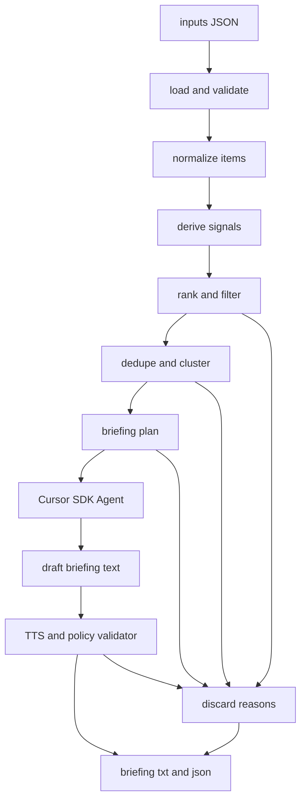

# 每日简报 Agent 架构规格

## Assumptions

- 使用 TypeScript 和 `@cursor/sdk`，基于官方 TypeScript SDK 文档。
- 第一版使用 Cursor SDK `local` runtime：`local: { cwd: process.cwd() }`，读写当前项目目录。
- 使用 `CURSOR_API_KEY` 环境变量，不提交任何 key。
- 目标是一个两小时内可交付的面试原型，不做 Web UI、数据库、后台服务或定时任务。
- `briefing.txt` 和 `briefing.json` 必须由程序生成；可以使用 Cursor SDK Agent 参与生成，但确定性规则要负责筛选、去重、隐私和校验。

## Objective

构建一个端到端可运行的 Agent 系统，读取 [inputs](inputs/) 下四份 JSON，输出英文 TTS 简报和可解释 metadata。

成功的定义：

- `briefing.txt` 是英文纯文本，无 Markdown、URL、邮箱，时长估算在 60 到 90 秒内。
- `briefing.json` 说明 included ids、discarded ids、丢弃原因、章节范围、估算秒数和方法。
- 系统显式处理日程冲突、private 事件、action-required 邮件、跨来源去重、profile 偏好例外和 TTS 数字口语化。
- `DECISIONS.md` 诚实解释架构取舍，而不是声称所有边界都完美处理。

## Architecture




核心决策：

- 不做单 prompt 一把梭。单 prompt 容易漏掉 private、数字口语化、discarded reasons 和 section ranges。
- 程序先做确定性分析，再让 Cursor SDK Agent 只负责“把已选事实写成自然英文 TTS 文本”。
- Cursor SDK 使用 `Agent.create` + `agent.send`，不是 `Agent.prompt`，因为我们需要多步上下文：先让 Agent 根据 briefing plan 起草，再根据 validator feedback 修订。
- Cursor SDK 使用 `await using agent = await Agent.create(...)`，保证资源释放；每个 run 都必须 `await run.wait()`。

## Proposed Project Structure

- [package.json](package.json): scripts 和依赖，包含 `@cursor/sdk`、TypeScript、测试工具。
- [src/index.ts](src/index.ts): CLI 入口，串起整个 pipeline。
- [src/schema.ts](src/schema.ts): 输入和输出类型/schema，边界验证。
- [src/loadInputs.ts](src/loadInputs.ts): 读取 `inputs/`。
- [src/signals.ts](src/signals.ts): profile 匹配、敏感性、action-required、日程关联、兴趣/反兴趣标记。
- [src/rank.ts](src/rank.ts): 打分、过滤、丢弃理由。
- [src/cluster.ts](src/cluster.ts): PSD3、Stripe、Lyra、Cobalt 等跨来源聚合。
- [src/briefingPlan.ts](src/briefingPlan.ts): 生成章节、目标词数、included ids。
- [src/cursorAgent.ts](src/cursorAgent.ts): Cursor SDK 调用、错误处理、run id 日志。
- [src/validateBriefing.ts](src/validateBriefing.ts): TTS 格式、URL/email/Markdown、词数和隐私校验。
- [src/writeOutputs.ts](src/writeOutputs.ts): 写出 `briefing.txt` 和 `briefing.json`。
- [tests/](tests/): 单元测试和 fixture 测试。

## Data Handling Rules

- Calendar:
  - 识别 `cal_006` 与 `cal_007` 的十五分钟冲突。
  - `cal_011` 只能泛化为 private appointment，不展开细节。
- Emails:
  - `action-required` 优先：`em_009`、`em_011`。
  - 将 `em_001`、`em_002`、`em_003` 合并进相关日程上下文。
  - `em_020` 按 sensitive personal 处理，不明说医疗细节。
- News:
  - 聚合 PSD3、Stripe、Lyra、Cobalt Labs 相关信息。
  - 丢弃体育、娱乐、普通 crypto price movement。
  - 保留 crypto enforcement 例外作为候选：`news_009`。
- Profile:
  - `Cobalt Labs` 是 always include。
  - `Maya Chen` 是 anything mentioning her goes in，但仍要保护语音场景下的隐私和简洁性。

## Cursor SDK Design

- Runtime: local。
- Auth: `CURSOR_API_KEY`。
- Model: 默认 `composer-2.5` 或先通过 `Cursor.models.list()` 检查可用模型；如果实现时间紧，使用 `model: { id: "auto" }` 可降低账号模型差异风险。
- Invocation:
  - `Agent.create({ apiKey, model, local: { cwd } })` 创建 Agent。
  - 第一次 `agent.send(prompt)`：根据 briefing plan 输出严格 JSON 或纯文本草稿。
  - 程序本地 validator 检查。
  - 如失败，第二次 `agent.send(feedback)` 要求修订。
- Error semantics:
  - `CursorAgentError` 表示 run 未启动，退出码可设为 1。
  - `result.status === "error"` 表示 run 启动后失败，退出码可设为 2。
  - `finished` 才写最终输出。

## Code Style

- TypeScript 使用小而明确的纯函数，pipeline 每一步输入输出都有类型。
- 对外部输入只在边界验证；内部函数信任已解析类型。
- 输出 metadata 使用稳定字段名，例如：

```typescript
interface BriefingMetadata {
  generatedAt: string;
  estimatedDurationSeconds: number;
  durationMethod: string;
  included: {
    calendar: string[];
    emails: string[];
    news: string[];
  };
  discarded: Array<{
    id: string;
    source: "calendar" | "email" | "news";
    reason: string;
  }>;
  sections: Array<{
    name: string;
    startLine: number;
    endLine: number;
    itemIds: string[];
  }>;
}
```

## Commands

- Install: `npm install`
- Generate: `npm run generate`
- Test: `npm test`
- Build/typecheck: `npm run build`
- Optional lint: `npm run lint`

## Testing Strategy

- Unit tests:
  - 日程冲突检测。
  - private/sensitive 处理。
  - profile preference 和 not_interested 过滤。
  - 去重聚合：PSD3、Stripe、Lyra。
  - TTS validator：URL、email、Markdown、数字符号。
- Integration test:
  - 使用原始 `inputs/` 跑完整 pipeline。
  - 若不想在测试里消耗 SDK，可 mock `cursorAgent`，验证 deterministic pipeline 和 output shape。
- Manual check:
  - 读一遍 `briefing.txt`，确认大约 60 到 90 秒且自然。

## Boundaries

- Always:
  - 保留所有 selected 和 discarded 的可解释原因。
  - 在写出前运行本地 validator。
  - 使用环境变量读取 Cursor API key。
  - 明确区分 SDK startup failure 和 run failure。
- Ask first:
  - 添加非必要依赖。
  - 改成 cloud runtime。
  - 引入数据库、Web UI、定时任务或多 Agent 并行架构。
- Never:
  - 提交 API key。
  - 泄露 private/medical details。
  - 伪造 input item。
  - 让 LLM 自行决定丢弃理由但不经过程序记录。

## Risks And Mitigations

- LLM 可能引入未提供事实：prompt 中只传 briefing plan，并要求不可新增事实；validator 和人工抽查兜底。
- LLM 可能输出数字符号：本地 validator 拦截，必要时二次修订。
- 75 秒目标难控：先按词数预算生成 plan，再按词数估算秒数。
- Cursor SDK public beta API 变化：实现时以官方文档为准，SDK 包版本不手写固定旧接口。
- metadata section range 易错：优先使用行范围而不是字符 offset，生成文本时按 section 拼接。

## Success Criteria

- `npm run generate` 能在设置 `CURSOR_API_KEY` 后生成 `briefing.txt` 和 `briefing.json`。
- `briefing.txt` 覆盖当天最重要的日程风险、action items 和高相关外部信号。
- `briefing.json` 能解释为什么体育、娱乐、Bitcoin 价格、自动通知、低价值邮件被丢弃。
- 输出不泄露 private 或医疗细节。
- 测试覆盖关键坑点，至少 deterministic pipeline 不依赖真实 SDK 调用也能验证。

