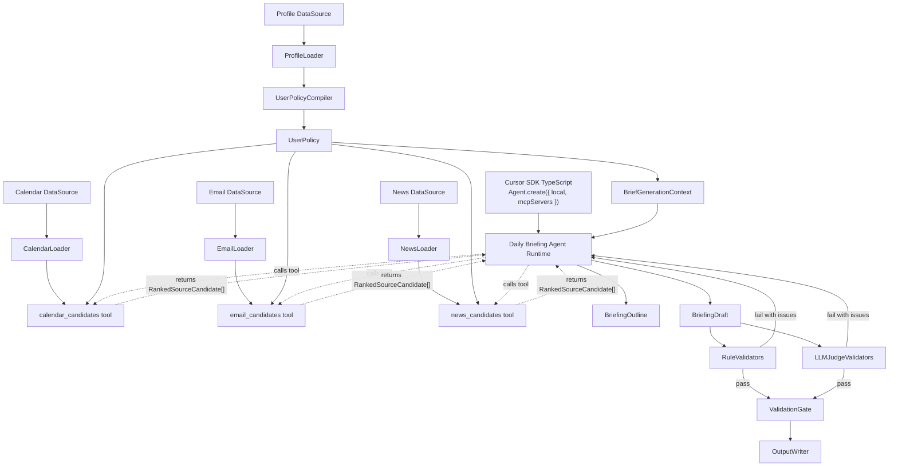

# Daily Briefing Agent Architecture Draft

> Temporary draft for review. This captures the current architecture discussion before merging it back into the formal plan.

allowed

This project should not be a single LLM prompt that summarizes four JSON files. It should be a small, repeatable Agent system where each information source is exposed to the Agent as a tool. The Agent calls those tools to receive explainable, scored `RankedSourceCandidate[]` outputs, then uses its runtime-loaded know-how to explore cross-source themes and generate the final English TTS briefing from an approved plan.

The most important design principle is:

- `DataSource` only loads data.
- Source candidate tools are the Agent-facing interface for calendar, email, and news.
- Each source candidate tool applies source-specific rules, user policy, tags, scoring, and optional model judgment before returning `RankedSourceCandidate[]`.
- Brief exploration and generation happen inside the Cursor SDK Agent runtime; skills are runtime-loaded know-how documents the Agent may consult, not application classes or domain services.
- Validators prove that core constraints were met.

## Key Correction: User Policy Enters Source Processing, Not Raw Data Loading

The user's profile should influence filtering, scoring, tags, and generation style. It should not be embedded in the raw `DataSource` layer, because `DataSource` should remain a reusable I/O abstraction.

Recommended model:

```typescript
class UserProfile {
  constructor(
    readonly userId: string,
    readonly interests: InterestPreference[],
    readonly exclusions: ExclusionPreference[],
    readonly trackedEntities: TrackedEntity[],
    readonly tone: TonePreference,
    readonly audioLength: AudioLengthPreference
  ) {}
}

class UserPolicyCompiler {
  compile(profile: UserProfile): UserPolicy;
}

class UserPolicy {
  constructor(
    readonly sourcePolicies: SourcePolicy[],
    readonly briefGenerationContext: BriefGenerationContext,
    readonly validationPolicy: ValidationPolicy
  ) {}
}
```

So the system does not hard-code "Jordan likes fintech" inside every component. Instead:

- The profile says Jordan tracks Cobalt, Stripe, Plaid, Lyra, and Maya.
- `UserPolicyCompiler` turns those preferences into source policies and a generation context.
- Each source candidate tool receives only the slice of policy relevant to that source.
- The Agent receives a compact, Agent-friendly `BriefGenerationContext`.

## Layered Architecture




## What Each Block Does

### DataSource

`DataSource<T>` abstracts where raw data comes from.

```typescript
interface DataSource<T> {
  readonly sourceName: string;
  load(): Promise<T>;
}
```

Current implementation:

- `JsonFileSource<RawProfileInput>`
- `JsonFileSource<RawCalendarInput>`
- `JsonFileSource<RawEmailInput>`
- `JsonFileSource<RawNewsInput>`

Future implementations:

- `GoogleCalendarSource`
- `GmailSource`
- `RssFeedSource`
- `SlackSource`
- `TaskSource`

The rest of the system should not know whether data came from a local file or an API.

### Domain Loaders

Each input domain has its own loader:

```typescript
class ProfileLoader {
  constructor(private source: DataSource<RawProfileInput>) {}
  async load(): Promise<UserProfile>;
}

interface BriefingItemProvider {
  loadItems(): Promise<BriefingItem[]>;
}

class CalendarLoader implements BriefingItemProvider {
  constructor(private source: DataSource<RawCalendarInput>) {}
  async loadItems(): Promise<CalendarBriefingItem[]>;
}

class EmailLoader implements BriefingItemProvider {
  constructor(private source: DataSource<RawEmailInput>) {}
  async loadItems(): Promise<EmailBriefingItem[]>;
}

class NewsLoader implements BriefingItemProvider {
  constructor(private source: DataSource<RawNewsInput>) {}
  async loadItems(): Promise<NewsBriefingItem[]>;
}
```

Responsibilities:

- Validate raw input shape.
- Normalize time fields.
- Preserve original ids.
- Attach provenance.
- Convert source-specific data directly into `BriefingItem` variants.

### Source Candidate Tools

After each loader returns normalized source items, the application exposes each information source to the Agent as a tool:

- `calendar_candidates`
- `email_candidates`
- `news_candidates`

These are the Agent-facing boundaries. When the Agent needs source context, it calls the relevant tools and receives `RankedSourceCandidate[]`. The tool implementation can use loaders, deterministic rules, model-assisted judges, and user policy internally, but the Agent does not talk to `DataSource`, loaders, processors, or source-specific policy objects directly.

The Agent should pass only request-level context such as the briefing date. The application wires each tool to the relevant `SourcePolicy` before exposing it through the Cursor SDK runtime.

Cursor SDK does not model these as in-process callback functions passed directly to the Agent. Custom Agent-callable tools should be exposed through MCP. For this project, that can be a lightweight local `stdio` MCP server owned by the repo; it does not need to be a deployed remote service. The server exposes the three source tools, and each tool returns `RankedSourceCandidate[]`.

```typescript
interface SourceCandidateTool {
  readonly name: "calendar_candidates" | "email_candidates" | "news_candidates";

  run(input: SourceCandidateToolRequest): Promise<RankedSourceCandidate[]>;
}

interface SourceCandidateToolRequest {
  briefingDate: string;
}

interface SourceProcessor<TItem extends BriefingItem> {
  readonly sourceType: "calendar" | "email" | "news";

  process(
    items: TItem[],
    policy: SourcePolicy,
    context: BriefingContext
  ): Promise<SourceProcessingResult>;
}

class CalendarSourceProcessor implements SourceProcessor<CalendarBriefingItem> {}
class EmailSourceProcessor implements SourceProcessor<EmailBriefingItem> {}
class NewsSourceProcessor implements SourceProcessor<NewsBriefingItem> {}
```

Each source candidate tool can combine two styles of judgment:

- Pure rules for deterministic facts and hard constraints.
- Model-assisted judges for semantic relevance that is hard to capture with simple rules.

For example:

- Calendar conflict detection is pure rule; if detected, it should produce a `mustInclude` candidate with a very high score object and explicit score reasons.
- `action-required` email labels are pure rule; ambiguous "does Jordan need to act today?" checks can use a model and add model-derived score reasons.
- Sports, entertainment, and daily crypto price news are pure rule drops; nuanced "is this fintech or AI news relevant to Jordan's work today?" can use a model.

Any rule-based or model-assisted judgment that affects ranking must return structured reasoning. The system should not accept a scoring decision without a reason that can be copied into `score.reasons`. The Agent-facing tool contract must be self-contained JSON: it should include the final numeric score and the reasons directly in the returned candidate, not return ids, pointers, or references to an internal trace store.

Topic tags are different from rule and scoring reasons. Tags describe the candidate's content themes so the Agent can group items into an outline. Processing labels such as "action required", "private", "automated", or "not interested" belong in score reasons, filter reasons, or restricted facts, not in topic tags.

Hard-dropped items can be omitted from the tool result, but the `SourceProcessingResult` must still keep their discard records so `briefing.json` can explain which input items were actively discarded and why.

```typescript
interface SourceProcessingResult {
  candidates: RankedSourceCandidate[];
  discarded: DiscardedItem[];
}

interface ModelJudgment {
  decision: "keep" | "drop" | "deprioritize";
  confidence: number;
  reason: string;
}

interface DiscardedItem {
  id: string;
  sourceType: "calendar" | "email" | "news";
  reason: string;
}
```

### UserPolicyCompiler

Compiles user profile data into source policies, a generation context, and validation policy.

For Jordan's profile, it creates rules such as:

- Include or heavily boost Cobalt Labs.
- Include Maya Chen mentions, while still respecting privacy and brevity.
- Boost Stripe, Plaid, and Lyra Finance.
- Penalize celebrity, entertainment, sports, and crypto price movement.
- Allow crypto regulation and enforcement exceptions.
- Enforce warm but efficient tone.
- Enforce 60 to 90 seconds, target 75 seconds.

This keeps user modeling separate from raw data access while still allowing each information source to apply user-specific rules. It is separated from `UserPolicy` because compilation is a process, while `UserPolicy` is the result used by the pipeline.

The first version should not try to dynamically translate arbitrary profile text into a full rules DSL. The profile is not authored in the shape of the rule system, and trying to infer a complete policy at runtime would make the prototype harder to reason about. Instead, implement a hard-coded compiler for this dataset:

```typescript
function compileJordanPolicy(profile: UserProfile): UserPolicy {
  return {
    sourcePolicies: {
      calendar: buildJordanCalendarPolicy(profile),
      email: buildJordanEmailPolicy(profile),
      news: buildJordanNewsPolicy(profile),
    },
    briefGenerationContext: buildJordanGenerationContext(profile),
    validationPolicy: buildJordanValidationPolicy(profile),
  };
}
```

That still preserves the important boundary: the rest of the pipeline consumes `UserPolicy`, not raw profile prose. Later, the hard-coded builders can be replaced with dynamic config loading or an Agent-assisted profile editor that emits the same `UserPolicy` shape.

`SourcePolicy` should be executable by source candidate tools, not just descriptive text. It should separate deterministic rule policy, model-judge policy, and privacy policy. The rule policy should support composable boolean conditions, similar to RSS filter systems where multiple predicates can be combined with all/any/not:

```typescript
interface SourcePolicy {
  sourceType: "calendar" | "email" | "news";
  rulePolicy: RulePolicy;
  modelPolicy: ModelPolicy;
  privacyRules: PrivacyRule[];
}

interface RulePolicy {
  filterRules: FilterRule[];
  scoringRules: ScoringRule[];
  topicTagRules: TopicTagRule[];
}

interface FilterRule {
  id: string;
  when: RuleExpression;
  action: "drop" | "deprioritize";
  reasonTemplate: string;
}

interface ScoringRule {
  id: string;
  when: RuleExpression;
  delta: number;
  reasonTemplate: string;
}

interface TopicTagRule {
  id: string;
  when: RuleExpression;
  topicTag: TopicTag;
  reasonTemplate: string;
}

type RuleExpression =
  | { all: RuleExpression[] }
  | { any: RuleExpression[] }
  | { not: RuleExpression }
  | RulePredicate;

type RulePredicate =
  | { field: string; op: "contains"; value: string }
  | { field: string; op: "equals"; value: string | boolean }
  | { field: string; op: "in"; values: string[] }
  | { field: string; op: "intersects"; values: string[] };

interface ModelPolicy {
  judges: ModelJudgeInstruction[];
}

interface ModelJudgeInstruction {
  id: string;
  prompt: string;
  appliesWhen: RuleExpression;
  outputSchema: "ModelJudgment";
}
```

The tool evaluates `RulePolicy` first because it is deterministic and auditable. Matching `ScoringRule`s become `score.reasons` with `source: "rule"`. Matching `TopicTagRule`s become `topicTags`. Matching hard filters become `DiscardedItem` records or `filterReasons`.

The tool then evaluates only the relevant `ModelPolicy.judges`. A model judge is used for semantic calls that are hard to express with rules, such as "is this fintech regulation item relevant to Jordan's work today?" or "does this email create an action Jordan personally needs to take?" Matching `ModelJudgment`s become `score.reasons` with `source: "model"` and must include confidence and reason text.

This makes the returned candidate useful to the Agent without exposing raw profile data or relying on hidden server-side traces.

Example hard-coded rules for the first version:

```typescript
const jordanNewsRulePolicy: RulePolicy = {
  filterRules: [
    {
      id: "drop_sports",
      when: { field: "titleAndSummary", op: "contains", value: "sports" },
      action: "drop",
      reasonTemplate: "User excludes sports scores and league standings.",
    },
    {
      id: "drop_daily_crypto_price_without_exception",
      when: {
        all: [
          { field: "titleAndSummary", op: "contains", value: "bitcoin" },
          { not: { field: "titleAndSummary", op: "contains", value: "regulation" } },
          { not: { field: "titleAndSummary", op: "contains", value: "enforcement" } },
        ],
      },
      action: "drop",
      reasonTemplate: "User excludes day-to-day crypto price movements unless they involve regulation or enforcement.",
    },
  ],
  scoringRules: [
    {
      id: "boost_cobalt_launch",
      when: { field: "titleAndSummary", op: "contains", value: "Cobalt Labs" },
      delta: 50,
      reasonTemplate: "Cobalt Labs is the user's company and launch news should always be surfaced.",
    },
    {
      id: "boost_tracked_fintech_entities",
      when: { field: "titleAndSummary", op: "intersects", values: ["Stripe", "Plaid", "Lyra Finance"] },
      delta: 25,
      reasonTemplate: "Item mentions a tracked fintech entity from the user's profile.",
    },
  ],
  topicTagRules: [
    {
      id: "tag_psd3",
      when: { field: "titleAndSummary", op: "contains", value: "PSD3" },
      topicTag: "psd3",
      reasonTemplate: "PSD3 is a briefing theme, not a scoring label.",
    },
  ],
};
```

The hard-coded policy should be small and explicit in version one. The migration path is to load the same shape from a config file later, or let an Agent propose profile edits that compile into this shape after human approval.

### Shared Briefing Item Model

There is no separate `ItemNormalizer` class. Each domain loader owns normalization for its own source because it understands that source's shape and edge cases. The common contract is that every content loader returns `BriefingItem` variants.

```typescript
type BriefingItem =
  | CalendarBriefingItem
  | EmailBriefingItem
  | NewsBriefingItem;

interface BaseBriefingItem {
  id: string;
  sourceType: "calendar" | "email" | "news";
  title: string;
  summary: string;
  occurredAt?: string;
  provenance: {
    sourceName: string;
    originalId: string;
    origin: "file" | "api";
  };
}
```

Downstream modules depend on `BriefingItem`, not on raw JSON file structure.

### Ranked Source Candidate

Every source candidate tool outputs candidates with topic tags, an explainable score object, speakable facts, and restricted facts. This is the main Agent-facing observability unit for the system.

```typescript
interface RankedSourceCandidate {
  id: string;
  sourceType: "calendar" | "email" | "news";
  title: string;
  topicTags: TopicTag[];
  score: CandidateScore;
  mustInclude: boolean;
  filterReasons: string[];
  speakableFacts: SpeakableFact[];
  restrictedFacts: RestrictedFact[];
  originalItemIds: string[];
}

type TopicTag =
  | "schedule"
  | "schedule_conflict"
  | "board_prep"
  | "customer_research"
  | "partner_stripe"
  | "vendor_plaid"
  | "competitor_lyra"
  | "company_launch"
  | "fintech_regulation"
  | "psd3"
  | "ai_product"
  | "developer_tools"
  | "personal_family";

interface CandidateScore {
  value: number;
  reasons: ScoreReason[];
}

interface ScoreReason {
  source: "rule" | "model";
  label: string;
  reason: string;
  delta?: number;
  confidence?: number;
}

interface SpeakableFact {
  raw: string;
  spoken: string;
}

interface RestrictedFact {
  redactedLabel: string;
  reason: string;
}
```

Examples:

- Calendar conflict candidate:
  - topicTags: `schedule`, `schedule_conflict`, `customer_research`, `personal_family`
  - score.value: high
  - mustInclude: true
  - score.reasons: conflict between Maya call and customer interview
- Plaid action candidate:
  - topicTags: `vendor_plaid`
  - score.value: high
  - mustInclude: true
  - score.reasons: action-required label, Plaid tracked entity, Jordan listed owner
- Bitcoin price candidate:
  - topicTags: none, because daily crypto price movement is not a briefing theme for this user
  - score.value: low or dropped
  - filterReasons: user excludes daily crypto price movement

`topicTags` are themes for outline construction, not the audit trail for scoring or filtering. The Agent uses them to discover cross-source clusters such as PSD3, Stripe, Lyra, Cobalt launch, schedule risk, board prep, or AI product news. Rule and model decisions that explain ranking belong in `score.reasons`. Drop or deprioritization explanations belong in `filterReasons`.

`score` must be a concrete, serializable object in the tool response. The Agent should be able to inspect the final number and every reason directly from the returned JSON. The tool must not return `scoreReasonIds`, opaque handles, or pointers to server-side scoring traces.

`speakableFacts` are the TTS-safe facts the Agent is allowed to use during generation. For example, instead of only passing `Cobalt processed $4B in beta volume`, pass a fact whose `spoken` value is `Cobalt processed four billion dollars in beta volume`. This reduces the chance that the Agent emits symbols such as `$4B` or `23%`.

`restrictedFacts` are safety traces. They can be returned to the Agent as constraints, but they are not source material for the spoken briefing. Validators can check redacted labels or policy constraints such as "do not reveal medical provider or medical purpose."

### Agent Exploration

Brief exploration is not an application class. It is a responsibility performed by the Daily Briefing Agent after it calls the three source candidate tools. Following the [Agent Skills model](https://agentskills.io/home), any skill involved here is a directory containing `SKILL.md` plus optional reference files, scripts, or assets. The Agent runtime may load that know-how when relevant, but the architecture boundary is the Agent and its tools, not a separate skill object.

The application-level contract is therefore the structured outline the Agent must produce after tool use:

```typescript
interface BriefingOutline {
  themes: BriefTheme[];
  sections: BriefingSectionOutline[];
  mustIncludeCandidateIds: string[];
  excludedCandidateIds: Array<{ id: string; reason: string }>;
  discardedInputItems: DiscardedItem[];
  explorationReasoning: string[];
}

interface BriefTheme {
  id: string;
  topicTags: TopicTag[];
  candidateIds: string[];
  reason: string;
}

interface BriefingSectionOutline {
  id: string;
  name: string;
  candidateIds: string[];
  coveredInputItemIds: {
    calendar: string[];
    emails: string[];
    news: string[];
  };
  targetWords: number;
}
```

Responsibilities:

- Call the calendar, email, and news candidate tools as needed.
- Explore each tool's ranked output.
- Identify today's theme categories from `topicTags`, such as schedule risks, launch context, regulation, or competitor watch.
- Merge duplicate or complementary facts across sources.
- Preserve every `mustInclude` candidate unless there is a documented impossibility.
- Produce section outlines with target word budgets, candidate ids, and covered input item ids.
- Preserve discarded input item records from source processing so `briefing.json` can explain which items were dropped and why.
- Output a compact `BriefingOutline` for generation.

Important cross-source themes in this dataset:

- PSD3: calendar compliance sync, action-required email, Reuters news.
- Stripe: lunch event, partner email, Issuing expansion news.
- Lyra: SDK teardown, funding news, new president.
- Board prep: board prep calendar event and CEO email.
- Cobalt launch: tracked company and GA news.

### Agent Generation

`BriefGenerationContext` is derived from user profile and should be Agent-friendly:

```typescript
interface BriefGenerationContext {
  toneRules: string[];
  interestRules: string[];
  exclusionRules: string[];
  trackedEntityRules: string[];
  targetDurationSeconds: number;
  minDurationSeconds: number;
  maxDurationSeconds: number;
}
```

Purpose:

- Translate the user's profile into instructions the Agent can reliably follow.
- Apply tone and length preferences.
- Generate a sectioned spoken brief from `speakableFacts`.
- Avoid using raw inputs directly.
- Preserve must-include items and explain if any cannot fit.
- Follow the section order from `BriefingOutline`; the program computes final section ranges after the text is generated.

The draft should preserve section structure internally even though the final TTS file is plain text:

```typescript
interface BriefingDraft {
  sections: BriefingDraftSection[];
  fullTextWithSectionMarkers: string;
  finalTtsText: string;
}

interface BriefingDraftSection {
  sectionId: string;
  title: string;
  text: string;
  candidateIds: string[];
}
```

The Agent may generate section titles internally because they make it easier to map text back to outline sections. Those titles and markers are metadata, not spoken content. The program should compute line and character ranges from `fullTextWithSectionMarkers`, then produce `finalTtsText` by removing section titles and markers. `NoMarkdownValidationRule` runs against `finalTtsText`, not the internal marked draft.

The generation know-how can live in an Agent Skill folder, but that folder is not shown as a separate component in the architecture. It is part of how the Agent performs the task at runtime, similar to instructions or reference material.

### Agent Skills Discovery

Skills are not passed to Cursor SDK as a `skills` parameter. They are discovered from the workspace file system. For this project, keep project-level skills in one of:

- `.cursor/skills/<skill-name>/SKILL.md`
- `.agents/skills/<skill-name>/SKILL.md`

Each skill folder may include `SKILL.md` plus optional `references/`, `scripts/`, or `assets/`. The Agent runtime loads the skill metadata, then loads the full instructions when the skill is relevant. For local SDK runs, `local.cwd` must point at the project root. Using `local.settingSources: ["project"]` makes the dependency on project-level Cursor configuration explicit. For cloud runs, the skill folders must be committed to the repo so the cloud Agent can discover them.

### CursorSdkDailyBriefingRunner

Uses the [Cursor SDK TypeScript runtime](https://cursor.com/docs/sdk/typescript) to create a local Agent and provide the three source candidate tools through MCP server configuration. The runner owns Agent lifecycle and validation/revision loops; it does not implement briefing intelligence itself.

```typescript
interface DailyBriefingAgentRunner {
  run(input: DailyBriefingRunInput): Promise<BriefingDraft>;
  revise(input: DailyBriefingRevisionInput): Promise<BriefingDraft>;
}

interface DailyBriefingRunInput {
  context: BriefGenerationContext;
  toolNames: ["calendar_candidates", "email_candidates", "news_candidates"];
}

class CursorSdkDailyBriefingRunner implements DailyBriefingAgentRunner {
  constructor(private options: CursorSdkRuntimeOptions) {}
}
```

Recommended local SDK wiring:

```typescript
import { Agent } from "@cursor/sdk";

await using agent = await Agent.create({
  apiKey: process.env.CURSOR_API_KEY!,
  model: { id: "composer-2.5" },
  local: {
    cwd: process.cwd(),
    settingSources: ["project"],
  },
  mcpServers: {
    "daily-briefing-sources": {
      type: "stdio",
      command: "node",
      args: ["dist/mcp/daily-briefing-tools.js"],
      cwd: process.cwd(),
    },
  },
});
```

Inline `mcpServers` are explicit and good for this runner because the three tools are part of the application contract. They are not persisted across `Agent.resume()`, so resume flows must pass them again. A file-based `.cursor/mcp.json` is also valid, but then the local SDK run must include project settings in `local.settingSources`.

Important boundary:

- It should not receive all raw inputs.
- It should not bypass the source candidate tools.
- It should not invent facts.
- It should not override privacy rules.

### Validators

Validation has two layers.

```typescript
interface RuleValidator {
  readonly name: string;
  validate(draft: BriefingDraft, outline: BriefingOutline): ValidationIssue[];
}

interface LlmJudgeValidator {
  readonly name: string;
  judge(
    draft: BriefingDraft,
    outline: BriefingOutline,
    candidates: RankedSourceCandidate[]
  ): Promise<ValidationIssue[]>;
}
```

Rule validators check objective constraints:

- `EnglishOnlyValidationRule`
- `NoMarkdownValidationRule`
- `NoUrlOrEmailValidationRule`
- `SpokenNumberValidationRule`
- `DurationValidationRule`
- `PrivacyLeakValidationRule`
- `OpeningVariationValidationRule`

Duration should be estimated with a standard words-per-minute assumption rather than an arbitrary constant. For English spoken audio, use roughly 155 words per minute:

```text
estimatedDurationSeconds = wordCount / 155 * 60
```

The output metadata should store both the estimate and the method.

LLM judge validators check semantic constraints:

- `MustIncludeCoverageJudge`: high-score or `mustInclude` candidates are reflected in the brief.
- `NoUnsupportedFactJudge`: the brief does not introduce facts outside candidate `speakableFacts`.
- `UserPreferenceFitJudge`: the brief respects the user's tone and topic preferences.

If validation fails, the draft is sent back to the Agent with concrete issues. Final files are written only after both rule validation and LLM judge validation pass.

### OutputWriter

Writes:

- `briefing.txt`
- `briefing.json`

Metadata should be generated from internal structures, not guessed by the LLM.

Program-computed metadata should include:

```typescript
interface BriefingMetadata {
  included: {
    calendar: string[];
    emails: string[];
    news: string[];
  };
  discarded: DiscardedItem[];
  sections: BriefingSectionMetadata[];
  wordCount: number;
  estimatedDurationSeconds: number;
  durationMethod: "Estimated from English word count at 155 words per minute.";
  mustIncludeCoverage: Array<{
    candidateId: string;
    covered: boolean;
    reason: string;
  }>;
}

interface BriefingSectionMetadata {
  id: string;
  name: string;
  candidateIds: string[];
  startChar: number;
  endChar: number;
  startLine: number;
  endLine: number;
}
```

Section ids, names, candidate ids, and target word budgets come from `BriefingOutline`. Final `startChar`, `endChar`, `startLine`, and `endLine` are computed by the program from the final `briefing.txt`; the model should not guess ranges.

## How This Design Handles The Known Dataset Traps

- `cal_006` and `cal_007` conflict: `CalendarSourceProcessor` detects overlap by rule, sets `mustInclude`, and gives it a very high `score.value` with explicit `score.reasons`.
- `cal_011` is private: `CalendarSourceProcessor` marks details as `restrictedFacts`; the Agent may only use generic wording from `speakableFacts`.
- `em_020` is medical: `EmailSourceProcessor` marks medical details as `restrictedFacts`; rule validators prevent medical detail leakage.
- `em_009` is Plaid action-required: `EmailSourceProcessor` boosts it by rule because it has `action-required`, mentions Plaid, and lists Jordan as owner.
- `em_011` is PSD3 action-required: `EmailSourceProcessor` boosts it; the Agent links it with `cal_009` and `news_002`.
- `em_001` links to board prep: the Agent links it with `cal_008`.
- `em_002` links to Priya one-on-one: the Agent links it with `cal_003`.
- `em_003` says tomorrow but was received the previous evening: source processing and exploration should use timestamps and event matching, not only the word "tomorrow".
- PSD3, Stripe, Lyra, and Cobalt are discovered as cross-source themes by the Agent.
- Cobalt Labs always include: generated from user policy and applied as source-level scoring plus generation context.
- Maya Chen anything mentioning her goes in: generated from user policy, but privacy rules still apply.
- Bitcoin price items are dropped or strongly deprioritized by source-level rules from user exclusion policy.
- Crypto enforcement remains eligible through the user's exception policy.
- Sports and entertainment are dropped with reasons by `NewsSourceProcessor`.
- Automated and low-value notifications are dropped or deprioritized with reasons by `EmailSourceProcessor`.
- TTS-risky numeric forms are converted into `speakableFacts.spoken` by source processors and validated by rule validators.
- Must-include coverage is checked by an LLM judge, because pure string checks are not reliable enough to verify semantic coverage.
- Section ranges are derived from the final text and `BriefingOutline`, not from model guesses.
- Duration metadata uses word count and a 155 words-per-minute estimate.

## Extensibility Principle

The system should be open for new data sources and user rules without rewriting the main pipeline.

Future additions should usually happen by adding one of:

- A new `DataSource`
- A new domain loader
- A new `SourceProcessor`
- A new source-level rule
- A new source-level model judge
- A new topic tag
- A new Agent Skill know-how folder
- A new rule validator
- A new LLM judge validator
- A new metadata field derived from existing internal structures

The pipeline itself should stay stable.