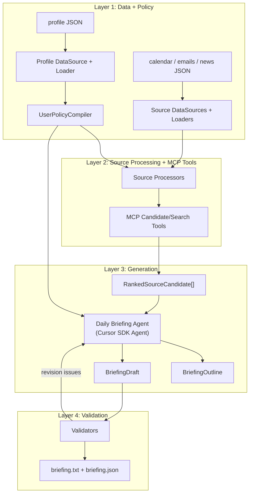

# Daily Briefing Agent 设计说明

## 1. 架构图

## 2. 关键设计决策

### 拆分

我没有把系统做成一个「把所有 JSON 塞进 prompt 然后总结」的单步调用，而是拆成了四层：

- 第一层是 data source、loaders 和 `UserPolicyCompiler`：读取并归一化输入，同时把 profile 编译成 source policies、生成上下文和验证策略。
- 第二层是 source processors 和 MCP candidate/search tools：按 policy 筛选、打分、打标签，生成隐私安全的可说事实，并把结果包装成 Agent 可以搜索的工具。
- 第三层是生成：`Daily Briefing Agent` 调用 candidate search，做跨源关联、去重，生成 `BriefingOutline` 和英文口播草稿。
- 第四层是验证：validators 检查时长、格式、隐私和必须覆盖项；当前主要是规则和 heuristic judge，全部通过后再写成 `briefing.txt` 和 `briefing.json`。

这样做的原因是：筛选、排序、隐私和可解释性不能完全依赖最终生成 prompt。确定性的事情应该留在代码里，语义整合和写作留给 Agent。

### 筛选与排序

筛选和排序的核心是：先把用户 profile 转成一套可执行的规则系统，再让每个 source processor 用这套规则决定什么要过滤、什么要加分、什么必须进入简报。

这套规则系统不是只有关键词匹配，也包含大模型判断：

- 确定性规则处理明确的偏好和硬约束，比如用户关注 Cobalt、Stripe、Plaid、Lyra，排除体育娱乐新闻，过滤普通比特币价格波动。
- 大模型判断处理语义更模糊的情况，比如一封邮件到底是不是低价值通知，或者某条内容是否有隐私风险。
- 每次过滤或加分都要留下原因，写进 `score.reasons`、`filterReasons` 或 `restrictedFacts`。

例如：一封 Plaid 的 `action-required` 邮件，如果收件人里 Jordan 是 owner，而且 Plaid 是用户关注的 vendor，规则会给它加分并标成 `mustInclude`。如果同一批新闻里有一条普通体育比分新闻，规则会直接过滤掉。对于一封标题像自动通知、但内容可能需要 Jordan 决策的邮件，可以交给大模型判断它是保留、降权还是丢弃。

处理完以后，每条保留下来的内容都会变成 `RankedSourceCandidate`，里面有最终分数、排序原因、主题标签、可说事实和受限事实。Agent 后面只基于这些候选项继续搜索、合并和写稿。

### 去重

去重不放在单个 source processor 里做，因为邮件、新闻和日程之间可能互相补充。例如 PSD3 可能同时出现在日程、邮件和新闻里。

我的设计是：candidate/search tools 返回可解释的候选项和 topic tags，Agent 可以先拉取各来源的 ranked candidates，也可以围绕某个主题继续搜索候选项。Agent 拿到三个来源的相关结果后，按 `topicTags`、实体和事实关联，把同一主题合并到一个 briefing section 里。这样可以避免重复播报，同时保留不同来源提供的补充信息。

### Profile 落地

用户 profile 不直接塞进每个 loader，也不只靠最终 prompt。系统先用 `UserPolicyCompiler` 把 profile 编译成三类内容：

- 每个 source 专属的过滤、加分、标签和隐私规则。
- Agent 可读的 `BriefGenerationContext`，包括语气、兴趣、排除项和时长目标。
- validators 使用的约束，例如时长、隐私泄漏、必须覆盖项。

这样 profile 同时影响候选项生成、最终写作和验证，而不是只在最后一条 prompt 里提醒模型。

### 时长控制

时长不是事后硬裁剪。Agent 先产出 `BriefingOutline`，每个 section 有目标词数；生成后再按 130 words per minute 估算口播时长，验证是否在 60 到 90 秒之间。

如果验证失败，runner 会把具体问题反馈给 Agent 进行修订，而不是直接截断文本。这样能减少逻辑断裂和重要事项丢失。

### 口播友好度

source processor 不负责最终 TTS，也不负责最终文案；它负责在候选项里生成 `speakableFacts.spoken`，也就是安全、可朗读的事实。这样 Agent 写稿时优先使用这些 spoken facts，例如把 `$4B` 写成 `four billion dollars`，同时避免说出 private 或 medical 细节。

最终验证还会检查：

- 不出现 URL 或 email 地址。
- 不出现 Markdown。
- 数字表达适合朗读。
- 输出是英文口播文本。

### 可观测性与调试

我希望系统能回答「为什么这条信息出现 / 没出现」。所以 source processing 会保留候选项分数、打分原因、过滤原因、discarded records、must-include 覆盖情况和最终 metadata。

最终 `briefing.json` 不只是输出结果，也是一份调试记录：它能说明哪些输入被包含、哪些被丢弃、每个 section 覆盖了哪些候选项、是否覆盖了必须出现的信息。

Langfuse tracing 是可选增强：如果配置了 Langfuse，就记录 source processing、Cursor SDK run、tool calls、Agent outline、draft 和 validation attempts；如果没配置，系统仍然可以本地运行。

## 3. AI 工具使用记录

我使用的 AI 工具主要是 Cursor。核心设计过程记录在 `ARCHITECTURE.md` 里。

我主要负责架构设计、类的设计、数据流设计和业务功能逻辑设计；最后也会看 `briefing.txt` 的生成结果和 Langfuse trace，再根据结果调整设计和验收。

Cursor 主要帮助我实现代码、debug、补测试和枚举边界条件。我会审核关键代码，尤其是 Cursor SDK 工具接入、source-layer 和 Agent-layer 的职责边界、以及隐私和验证逻辑。

如果再做一次，我会少让 AI 参与设计，更多把设计定清楚以后再让它实现。

## 4. 已知限制

- 当前 policy compiler 是针对 Jordan 数据集的第一版硬编码实现，还不是通用 profile 规则编辑器。
- LLM judge validator 目前更像 adapter 形状，当前没有真的调用模型做验证，后续可以替换成更强的真实模型评审。
- candidate search 这一块还比较基础，主要是在处理后的候选项上做搜索，没有引入更精细的向量化搜索或本地索引。
- 时长控制使用词数估算，没有接入真实 TTS 引擎测量音频长度。

## 5. 如果再多两小时

- 让 policy compiler 支持任意用户添加、修改、删除偏好，并更新成可持久化的配置。
- 引入 [qmd](https://github.com/tobi/qmd)，把本地 candidate search 做得更好。
- 把真实的大模型 judge 接进 validators，用来检查 must-include 覆盖、unsupported facts 和用户偏好匹配。

